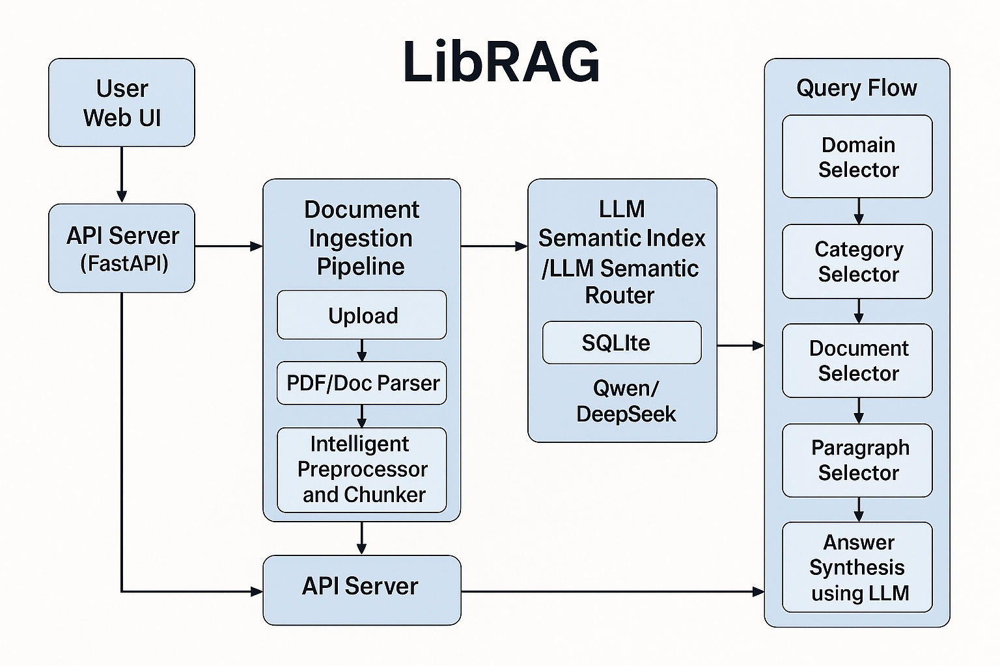

  
  
  

 

# LibRAG

**LibRAG** is a universal intelligent content-retrieval engine that breaks through the limitations of traditional RAG architectures.
By applying *end-to-end model-level reasoning*, it reconstructs document preprocessing and paragraph recall from the ground up.
Instead of relying on embedding models, vector databases, and other heavyweight components, LibRAG exploits the deep semantic-understanding capabilities of large language models (LLMs) to deliver precise, end-to-end retrieval and recall.
Typical use cases include enterprise knowledge management, domain-specific Q\&A, compliance review, medical record search, financial risk control, AI agents, and more.

# Architecture Overview

The system combines multi-level semantic parsing with a unified indexing technique to convert text into searchable knowledge units; a semantic routing layer then performs on-demand, fine-grained recall and answer generation.

LibRAG makes RAG *simpler* and *smarter*: an LLM performs document preprocessing, paragraph recall, ranking, and answer generation in one shot—no embeddings or vector stores required.
The diagram below (blue boxes = core modules, black arrows = main data/control flow) illustrates how each layer works together.

## 1  Layered Architecture

### ▍Web UI + API Server

* **Frontend (Vue 3 + Element-Plus)**—folder `web/`: file upload, KB configuration, Q\&A. Built with Vite ([GitHub](https://github.com/Yumben-Open-Source-AI/LibRAG/raw/main/web/package.json))
* **Backend (FastAPI)**—`rag-app/main.py`: routes under `/ai`, REST APIs, auto-creates tables on startup ([GitHub](https://github.com/Yumben-Open-Source-AI/LibRAG/raw/main/rag-app/main.py), [GitHub](https://github.com/Yumben-Open-Source-AI/LibRAG/raw/main/rag-app/db/database.py))

### ▍Document Ingestion Pipeline

1. **Upload** → files stored in `./files`, background task parses asynchronously ([GitHub](https://github.com/Yumben-Open-Source-AI/LibRAG/raw/main/rag-app/web_server/ai/router.py))
2. **Format Parsing** → `DocumentParser` calls *Pdf-Extract-Kit* etc. (see `download_models.py`) to extract text/layout ([GitHub](https://github.com/Yumben-Open-Source-AI/LibRAG/raw/main/download_models.py))
3. **Intelligent Chunking** → hybrid “sliding window + semantic boundary” splitter; multi-agent LLMs do error-correction / de-identification ([GitHub](https://github.com/Yumben-Open-Source-AI/LibRAG/raw/main/README.md) etc.)
4. **Write to SQLite** → all paragraphs & metadata stored via SQLModel ORM (`KnowledgeBase`, `Document`, `Paragraph`, …) ([GitHub](https://github.com/Yumben-Open-Source-AI/LibRAG/raw/main/rag-app/db/database.py))

### ▍LLM Semantic Index & Routing Layer

* **Index** → stores *domain → category → document → paragraph* metadata—no vectors; auto-rebuilds on updates
* **Router** → on query, the LLM (Qwen-14B / DeepSeek by default) filters step-by-step:

  1. `DomainSelector`
  2. `CategorySelector`
  3. `DocumentSelector`
  4. `ParagraphSelector` (few-shot + rules) ([GitHub](https://github.com/Yumben-Open-Source-AI/LibRAG/raw/main/rag-app/selector/paragraph_selector.py))

### ▍Retrieval → Ranking → Generation

* Candidate paragraphs pass a BM25 coarse ranker, then the same LLM re-ranks and drafts an answer.
* If multi-paragraph stitching is on, high-scoring paragraphs are inserted into the final prompt and answered by the same LLM.

## 2  Technical Highlights

| Traditional RAG                              | **LibRAG**                                                 |
| -------------------------------------------- | ---------------------------------------------------------- |
| Embeddings + vector DB + rerank models       | A single LLM handles understanding, indexing, and ranking  |
| Accuracy depends on heavy hyper-param tuning | Semantic reasoning → claimed “> 90 % out of the box”       |
| Multi-hop/routing loses details              | Selector chain + semantic router keeps year/subject intact |
| Structured data needs extra ETL              | Same index layer will soon fuse tables/DB data             |

These designs align with recent community trends such as “vector-free RAG” and “semantic routing”.

## 3  Deployment / Runbook

1. **Download models**: `python download_models.py`—grabs PDF-Extract-Kit & LayoutReader and writes `magic-pdf.json`.
2. **Start backend**: `uvicorn rag-app.main:app --host 0.0.0.0 --port 13113`
3. **Frontend hot-reload**: `pnpm install && pnpm dev` (or npm/yarn)
4. **Persistence**: SQLite by default; swap to PostgreSQL by changing `sqlite_url` to `postgresql+psycopg://...`.

## 4  Roadmap

* **Multi-LLM collaboration**—function-call router to offload math/code.
* **Paragraph vector cache**—optional FAISS cache for high-QPS scenarios.
* **Distributed DB**—swap SQLite for TiDB / CockroachDB.
* **Security**—auth middleware, CORS whitelist, etc.

# Core Breakthroughs

## 1  Smart Document Pre-processing

**Dynamic structural parsing** of PDF, Word, TXT, Markdown, etc. Hybrid splitting (sliding window + semantic boundary) yields coherent chunks, avoiding semantic fragmentation.

**Content quality enhancement**—built-in multi-agent LLMs correct errors and mask sensitive data (e.g., automatic anonymization of patient info in medical docs).

## 2  Inference-Driven Paragraph Recall

**Semantic-reasoning matching**—the model analyses multi-dimensional relations between queries and paragraphs, replacing vector similarity and capturing hidden logic (causality, contrast, …).

**Hybrid recall strategy**—keyword hits fused with deep semantic scores; an in-house weighting algorithm raises recall accuracy by > 40 % versus traditional methods.

## 3  AI-Native Index

A novel index that needs *no* embeddings, vector DB, or graph DB—tailor-made for LLMs.

## 4  Self-Evolving, Zero-Maintenance Architecture

**Self-evolving**—any document change triggers lightweight index updates; typical docs sync in minutes, meeting real-time demands in finance, law, etc.

**Zero maintenance**—precision stays stable as the corpus grows; no manual tuning required.

# Advantages over Traditional RAG

| Dimension           | Traditional RAG                                      | LibRAG                         |
| ------------------- | ---------------------------------------------------- | ------------------------------ |
| Stack complexity    | Embedding model + vector DB + reranker               | Single inference model         |
| Recall precision    | < 50 % without costly tuning                         | > 90 % with minimal effort     |
| Build & ops cost    | Heavy manual work: labeling, chunking, vector tuning | Fully automated, self-evolving |
| Domain adaptability | Embeddings, prompts, FAQs must be tailored           | Works across domains           |

### 1  Infrastructure & Ops Complexity

| Legacy Approach                                            | Drawbacks                                                                                         | **LibRAG Improvements**                                                                                         |
| ---------------------------------------------------------- | ------------------------------------------------------------------------------------------------- | --------------------------------------------------------------------------------------------------------------- |
| Generate embeddings → persist vectors → maintain ANN index | • Full-recompute on model change • Vector index tuning/scaling is time-consuming and expensive | • Store plain text + metadata only (SQLite/PostgreSQL) • *No* vector index at all—model upgrades are instant |

---

### 2  Recall vs. Precision

| Vector Retrieval                    | Pain Points                                                                                      | **LibRAG Multi-Level Router**                                                                                    |
| ----------------------------------- | ------------------------------------------------------------------------------------------------ | ---------------------------------------------------------------------------------------------------------------- |
| Cosine/Dot-NN → often low precision | • High recall / low precision—many near-topic but irrelevant chunks • Requires extra reranker | • Four-level semantic filter (Domain → Category → Document → Paragraph) • Hits are precise, rerank load drops |

---

### 3  Poor Query Understanding

| Legacy                       | Risks                                                                                                | **LibRAG**                                                                                    |
| ---------------------------- | ---------------------------------------------------------------------------------------------------- | --------------------------------------------------------------------------------------------- |
| Directly embed the raw query | • Key intent diluted (“How to organize components in a React project” returns “What is a component”) | LLM first rewrites/decomposes via Selector chain—like “think of keywords first, then search.” |

---

### 4  Chunk Granularity & Semantic Breaks

| Fixed byte/sentence chunks | Issues                                                                                                              | **LibRAG Dynamic Splitting**                                                                                              |
| -------------------------- | ------------------------------------------------------------------------------------------------------------------- | ------------------------------------------------------------------------------------------------------------------------- |
| Hard-length cuts           | • Definitions split across chunks, vector distortion • Too many chunks → huge index; too few → diluted semantics | Parse layout → cut by **TOC, heading levels, semantic pauses**—chunks stay coherent; no painful size-vs-quality trade-off |

---

### 5  Update Latency & Stale Index

| Vector Flow                        | Risk                                 | **LibRAG**                                    |
| ---------------------------------- | ------------------------------------ | --------------------------------------------- |
| New doc → Extract → Embed → Insert | • Minutes to hours on large clusters | Insert to DB, live instantly—**zero-latency** |

---

### 6  Hallucination & Explainability

| Legacy                              | Issue                                              | **LibRAG**                                                                                                |
| ----------------------------------- | -------------------------------------------------- | --------------------------------------------------------------------------------------------------------- |
| Low-precision recall + giant prompt | • Noisy context → LLM hallucination, hard to trace | Fine-grained filtering → each citation maps to a single paragraph; shorter context = fewer hallucinations |

---

## Summary

> **LibRAG simultaneously tames the three key RAG risks—complexity, precision, freshness:**
>
> * **Vector-free** → ultra-simple ops, model upgrades painless.
> * **Multi-level semantic router** → higher precision & explainability.
> * **Dynamic chunking + metadata index** → live in seconds for new docs.

If you struggle with “vector DB tuning,” “retrieved text is useless,” or “embedding change forces full rebuild,” LibRAG offers a ready-made remedy.

# Precision RAG – Technical Challenges

## 1  Multi-Hop Reasoning

> *Multi-hop* questions require pulling info from multiple docs/steps (e.g., compute a firm’s 3-year CAGR then compare rivals).

**Challenge**: answers span multiple docs/paragraphs and may need calculations.

### LibRAG’s Solutions

| Mechanism                                                                  | How it eases multi-hop                                                                                                                |
| -------------------------------------------------------------------------- | ------------------------------------------------------------------------------------------------------------------------------------- |
| **Four-level semantic routing** (Domain → Category → Document → Paragraph) | LLM decomposes the query before retrieval, performing small-scope “reason-&-search” at each level—natural chain-of-thought retrieval. |
| **Paragraph-level metadata**                                               | Each chunk carries doc ID, year, page …; downstream LLM can quote or compute without losing provenance.                               |
| **Inference-based rerank**                                                 | After coarse recall, the same LLM does chain-reasoning scoring, bubbling up cross-doc evidence for the final answer.                  |

---

## 2  Routing (Semantic Disambiguation)

Highly similar files (e.g., annual reports for different years) can blur key fields like the fiscal year.

**Challenge**: tons of near-duplicate docs; year info easily lost.

### LibRAG’s Solutions

| Pain Point                  | Remedy                                                                                                           |
| --------------------------- | ---------------------------------------------------------------------------------------------------------------- |
| **Year confusion**          | Selector prompt includes `{year}`, `{fiscal_period}` as *hard constraints*; LLM discards mismatched years early. |
| **Near-text false recalls** | LLM computes deep semantic similarity—paragraphs must match both surface words *and* meaning.                    |
| **Untraceable outputs**     | Final answers ship paragraph IDs; users can jump back to the source doc/page.                                    |

---

## 3  Structured-Data Integration

Enterprises hold massive structured data (DBs, spreadsheets). How to fuse it with RAG without losing precision?

### LibRAG’s Solutions

1. **Unified index *is* a database**

   * Default SQLite stores “paragraphs + metadata.” Add a `structured_table` (cols, values, units, PK) and reuse the same selectors.
2. **Table → NL view**

   * During ingestion, each row is auto-verbalized (“Q1 2023 revenue: 5 B CNY”) and indexed as a paragraph—retrieval precision remains.
3. **Function-call bridge**

   * For aggregations (e.g., CAGR), answer-synthesis prompt exposes `call_sql()` / `call_pandas()`. When LLM detects “needs calculation,” the API executes and feeds results back.

---

## 4  Technical Boundaries & Ecosystem

RAG is only one piece. It must cooperate with function calls, agents, etc., not replace them.

### LibRAG’s Solutions

| Scenario                         | Integration                                                                                                                              |
| -------------------------------- | ---------------------------------------------------------------------------------------------------------------------------------------- |
| **External API / function call** | Selector flags `need_call=…` (e.g., live FX rate); external tool fetches data, returned JSON is inserted into the prompt.                |
| **Agent frameworks**             | LibRAG API returns `route_trace` + `evidence_set`; agents can continue reasoning, planning, tool calls.                                  |
| **Modular deployment**           | Ingestion, index service, inference service are separate. Swap vector-free retrieval for Elasticsearch/Weaviate without touching others. |

---

### Summary

> **Selector chain + AI-native index + functional extensions** give a pragmatic, production-ready answer to multi-hop, routing, structured-data, and orchestration challenges.
