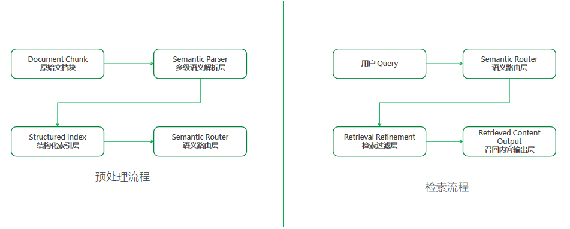
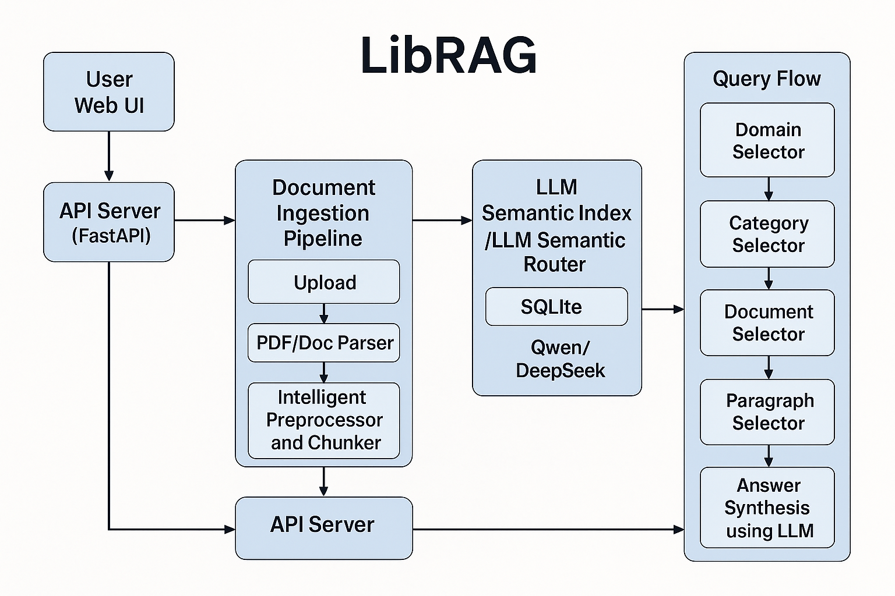

  
  
  

 

# LibRAG
LibRAG は、従来型 RAG アーキテクチャを刷新する汎用インテリジェント・コンテンツリコールエンジンです。**エンドツーエンドのモデル推論能力**を活かして文書の前処理と段落リコールのプロセスを再構築し、埋め込みモデルやベクトルデータベースといった複雑なコンポーネントを排除します。大規模言語モデル（LLM）の深い意味理解を直接利用することで高精度な検索と召喚を実現し、企業知識管理や専門分野 Q&A、コンプライアンス審査、医療カルテ検索、金融リスク管理、AI エージェントなど幅広いシーンに適用できます。

# アーキテクチャ概要
システムは**多段階の意味解析 + 統合インデックス技術**を採用し、テキストを検索可能な知識ユニットへ変換。さらに意味ルーティング層によって、必要に応じた高精度リコールと回答生成を行います。

LibRAG は従来の RAG をよりシンプルかつインテリジェントに分解しました。LLM の深層意味推論を用いて、文書前処理・段落リコール・リランキング・回答生成を**ワンストップ**で実行し、埋め込みベクトルやベクトル DB を完全に排除します。以下は全体アーキテクチャ図（青枠がコアモジュール、黒矢印が主なデータ／制御フロー）と、それぞれのコンポーネントがどのように連携するかのレイヤ別解説です。

## 1 全体レイヤー構成

### ▍Web UI + API サーバー
- **Vue 3 + Element-Plus** フロントエンド（`web/`）：ファイルアップロード、ナレッジベース設定、QA クエリを担当。Vite でビルド ([GitHub](https://github.com/Yumben-Open-Source-AI/LibRAG/raw/main/web/package.json))
- **FastAPI** バックエンド（`rag-app/main.py`）：`/ai` ルートで REST API を公開し、起動時にテーブルを作成 ([GitHub](https://github.com/Yumben-Open-Source-AI/LibRAG/raw/main/rag-app/main.py), [GitHub](https://github.com/Yumben-Open-Source-AI/LibRAG/raw/main/rag-app/db/database.py))

### ▍文書インジェストパイプライン
1. **アップロード**：ファイルはまず `./files` に保存され、バックグラウンドタスクで非同期解析 ([GitHub](https://github.com/Yumben-Open-Source-AI/LibRAG/raw/main/rag-app/web_server/ai/router.py))
2. **フォーマット解析**：`DocumentParser` が `Pdf-Extract-Kit` などのモデルを呼び出してテキスト／レイアウトを抽出 ([GitHub](https://github.com/Yumben-Open-Source-AI/LibRAG/raw/main/download_models.py))
3. **インテリジェント分割**：スライディングウィンドウ＋意味境界アルゴリズムで段落を生成し、複数エージェントで校正／マスキング ([GitHub](https://github.com/Yumben-Open-Source-AI/LibRAG/raw/main/README.md) ほか)
4. **SQLite へ書き込み**：全段落とメタデータを SQLModel ORM で `KnowledgeBase / Document / Paragraph …` テーブルに保存 ([GitHub](https://github.com/Yumben-Open-Source-AI/LibRAG/raw/main/rag-app/db/database.py))

### ▍LLM 意味インデックス & ルーティング層
- **インデックス**：ベクトルを生成せず、「ドメイン→カテゴリ→ドキュメント→段落」の 4 階層メタを保存し、更新時に自動再構築
- **Router**：クエリ受信時、LLM（デフォルト Qwen-14B または DeepSeek）が 4 段階 Selector で絞り込み  
  1. `DomainSelector`  
  2. `CategorySelector`  
  3. `DocumentSelector`  
  4. `ParagraphSelector`（few-shot + ルールはソース参照）

### ▍検索-リランキング-生成
- 候補段落を BM25 で粗選別後、LLM が再ランク付けして回答ドラフトを生成
- 複数段落の結合を有効にすると、高スコア段落を最終 Prompt に組み込み、同一 LLM が回答を完成

## 2 技術的ハイライト

| 従来 RAG | **LibRAG** |
| -------- | ---------- |
| 埋め込み + ベクトル DB + リランキングなど複数コンポーネント | 単一 LLM で理解＋インデックス＋リランキング |
| 精度は専門的なチューニングに依存 | 意味推論でマッチング、90% を超える即戦力精度 |
| マルチホップ & ルーティングで情報欠落が発生しやすい | Selector チェーン + 意味 Router で年月・主体の欠落を防止 |
| 構造化データは追加 ETL が必要 | 将来的に同一インデックス層でテーブル／DB を統合予定 |

## 3 デプロイ / 実行のポイント
1. **モデルダウンロード**：`python download_models.py` で PDF-Extract-Kit と LayoutReader の重みを取得し `magic-pdf.json` を自動更新
2. **バックエンド起動**：`uvicorn rag-app.main:app --host 0.0.0.0 --port 13113`
3. **フロントエンド（Vite ホットリロード）**：`pnpm install && pnpm dev`
4. **永続化**：デフォルト SQLite。PostgreSQL を使う場合は `sqlite_url` を `postgresql+psycopg://...` に変更

## 4 今後の改善方向
- **マルチ LLM 協調**：function-call router を導入し、数値計算やコード解釈を専門モデルへ分流
- **段落ベクトルキャッシュ**：高負荷時に FAISS など軽量キャッシュで初段フィルタを追加
- **分散 DB**：SQLite を TiDB / CockroachDB に置き換え、大量段落へ対応
- **セキュリティ**：認証ミドルウェア、CORS ホワイトリストの追加

# コア技術ブレークスルー
## 1. インテリジェント文書前処理エンジン
- **動的構造化解析**：PDF、Word、TXT、Markdown など多フォーマットを自動解析。スライディングウィンドウ＋意味境界判定で整合性あるテキストチャンクを生成し、従来のチャンク切断による意味断裂を解消  
- **内容品質向上**：LLM マルチエージェントで校正・機密情報マスキングを行い、医療文書の患者情報匿名化などコンプライアンスを確保

## 2. 推論駆動型段落リコールメカニズム
- **意味推論マッチング**：ユーザークエリと段落の多次元関連性を LLM が直接分析し、ベクトル類似度を代替。因果関係や対比論証など潜在ロジックも把握  
- **ハイブリッドリコール戦略**：キーワードヒットと深層意味推論スコアを融合し、独自重み付けで高精度位置特定。従来比 40% 以上の精度向上

## 3. AI ネイティブインデックス構造
- 埋め込みモデルやベクトル／グラフ DB に依存せず、LLM 技術に最適化した高効率インデックスを実現

## 4. 自己成長型ノーメンテナンスアーキテクチャ
- **自己成長**：文書変更後にインデックスを自動微調整。金融・法務などで要求されるタイムリーな知識同期を分単位で完了  
- **無保守**：文書が増えても精度が低下せず、人工チューニング不要

# 伝統的 RAG との主要な比較優位

| 観点 | 従来 RAG 案 | **LibRAG 案** |
| ---- | ----------- | -------------- |
| 技術スタックの複雑さ | 埋め込みモデル＋ベクトル DB＋リランキング | 単一推論モデルで完結 |
| 召喚精度 | 調整前 <50%、調整コスト高 | 調整不要で >90%、業務担当者でも微調整可 |
| 構築・保守コスト | 大量の人工ラベル付け、分割、ベクトル更新 | 全自動処理、自己成長で無保守 |
| 领域適応性 | 垂直分野ごとにモデル／プロンプトをカスタム | 全分野対応 |

## 1 インフラと運用の複雑さ
| 従来手法 | 課題 | **LibRAG の改善** |
| -------- | ---- | ----------------- |
| 埋め込み生成→ベクトル永続化→ANN インデックス維持 | ・モデル変更で全量再計算 ・大規模インデックスの調整・スケールが高コスト | ・**プレーンテキスト＋メタデータ**のみ保存、**ベクトルインデックス不要** ・モデル更新でも即時反映 |

## 2 検索精度 vs. 召喚率
| 従来ベクトル検索 | 典型的課題 | **LibRAG 多段 LLM Router** |
| --------------- | ---------- | --------------------------- |
| 余弦／内積近傍→精度不足でリランキング必須 | **高召喚・低精度**問題 | **ドメイン→カテゴリ→ドキュメント→段落** の意味フィルタで精密化し、リランキング負荷を削減 |

## 3 クエリ理解不足
| 従来フロー | 隠れたリスク | **LibRAG 対応** |
| ---------- | ----------- | --------------- |
| **生クエリ**を直接ベクトル化 | 意図が埋没しやすい | LLM が **Selector チェーン**でクエリを分解・書き換え後に検索 |

## 4 チャンク粒度と意味断裂
| 従来の固定長分割 | リスク | **LibRAG 動的意味分割** |
| -------------- | ----- | ---------------------- |
| 長さ閾値でカット | 定義が分断、インデックス膨張／希釈 | レイアウト解析＋**目次・見出し・意味停頓**で自律チャンク |

## 5 更新遅延と索引陳腐化
| ベクトル方式 | リスク | **LibRAG** |
| ------------ | ------ | ----------- |
| 新文書は「抽出→埋め込み→挿入」必須 | 大規模環境で数十分〜数時間 | **INSERT 即利用**、ゼロ遅延 |

## 6 幻覚と説明可能性
| 従来 | 課題 | **LibRAG** |
| ---- | ---- | ---------- |
| 低精度召喚＋巨大 Prompt | ノイズ段落で幻覚、追跡困難 | 厳密フィルタで **段落単位エビデンス**、短コンテキストで幻覚低減 |

## 総括
> **LibRAG は「複雑さ・精度・即時性」の 3 大リスクを同時に解消します。**  
> - **脱ベクトル化**：運用が極めてシンプル、モデル更新も即時反映  
> - **多段意味 Router**：精度と説明性を両立  
> - **動的チャンク＋メタインデックス**：デプロイと増分更新が秒単位で完了  

ベクトル DB のチューニングや、役に立たない検索結果、モデル変更での再計算に悩むなら、LibRAG の設計思想が最適解です。

# 精密 RAG ― 技術的課題

## 1. マルチホップ問題
複数データソース／手順を跨いで情報を抽出し、最終回答を得る必要があるケース。例：過去 3 年の CAGR を算出し、競合と比較。

**LibRAG の対策**

| メカニズム | マルチホップ緩和策 |
| ---------- | ----------------- |
| **4 段階 Selector ルーティング** | 検索前に LLM が問題を「ドメイン→カテゴリ→ドキュメント→段落」に分解し、小範囲の推論検索をチェーン化 |
| **段落メタ保持** | 年度・ページ等のメタを保持し、後続 LLM が複数エビデンスを直接引用 |
| **推論駆動リランキング** | 召喚後に LLM がチェーン推論＋スコアリングし、跨文書証拠を優先配置 |

## 2. ルーティング問題
類似ファイル（例：年度別財務報告）が多く、年度など重要フィールドを失いやすい。

**LibRAG の対策**

| 課題 | 解決策 |
| ---- | ------ |
| **年度混在** | Selector Prompt に `{year}` などをハード制約として明示 |
| **テキスト類似で誤召喚** | LLM が深層意味一致を評価し、語面＋意味の両立でフィルタ |
| **追跡困難** | 回答に段落 ID を付与し、ソースページを逆引き可能 |

## 3. 構造化データの取り込み
SQL／Excel 等の構造化データを精度を失わずに RAG と統合する課題。

**LibRAG の対策**
1. **統合インデックス層として DB を使用**：`structured_table` を追加するだけで同じ Selector 機構を共有  
2. **表→自然言語ビュー**：行データを「2023 年 Q1 売上 50 億円」のような文に変換して登録  
3. **関数呼び出しブリッジ**：`call_sql()` などのプレースホルダで数値集計を API 層が実行

## 4. 技術的境界 & 他技術との協調
RAG は全能ではなく、他技術との連携が必要。

**LibRAG の対策**

| シナリオ | 協調方式 |
| -------- | -------- |
| **外部 API／function-call** | Router が `need_call=xxx` を返し、リアルタイムデータを関数で取得後 Prompt に挿入 |
| **Agent フレーム統合** | `route_trace` と `evidence_set` をエージェントが引き継ぎ可能 |
| **モジュール化デプロイ** | 各サービスが独立。希望により検索サービスを Elasticsearch 等に置換可能 |

### 総括
> **LibRAG は Selector チェーン＋AI ネイティブインデックス＋関数型拡張の 3 本柱で、マルチホップ・ルーティング・構造化・協調の 4 大課題に対する実用的ソリューションを提供します。**
## オンラインでの体験はご連絡をお願いします。
>http://home.yumben.cn:42800/login

>lsf@yumben.com 備考:社名、使用シーン、ドキュメント規模をお願いします。
