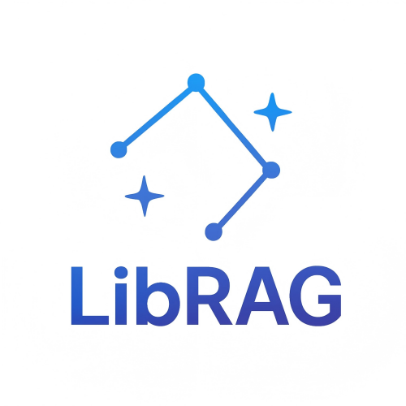

  
  
  

 

# LibRAG

LibRAG は、従来の RAG アーキテクチャを打ち破る汎用型のインテリジェント・コンテンツ検索エンジンです。エンドツーエンドの推論能力により、文書の前処理と段落リコールのフローを再構築します。本製品は埋め込みモデルやベクトルデータベースなどの複雑なコンポーネントを排し、大規模言語モデル（LLM）の深層意味理解を直接活用して高精度な検索・リコールを実現。企業ナレッジ管理、専門分野 Q&A、コンプライアンス審査、医療カルテ検索、金融リスク管理、AI エージェントなど、多様な AI 活用シーンに適用できます。

# アーキテクチャ概要

本システムは、多段階の意味解析と統一インデックス技術を採用し、テキストを検索可能な知識ユニットへ変換します。さらに意味ルーティング層により、必要に応じた精密リコールと回答生成を行います。

  

# 主要技術のブレークスルー

## 1. インテリジェント文書前処理エンジン

**動的構造化解析**
 PDF、Word、TXT、Markdown など多様なフォーマットを自動解析。スライディングウィンドウ＋意味境界判定のハイブリッド分割アルゴリズムで連続したテキストブロックを生成し、従来の分割で生じる意味分断を解消します。

**コンテンツ品質強化**
 LLM ベースのマルチエージェントを組み込み、前処理段階での誤り訂正や機微情報のマスキングを自動化。入力データの完全性とコンプライアンス（例：医療文書の患者情報自動匿名化）を担保します。

## 2. 推論駆動の段落リコール機構

**意味推論マッチング**
 モデルがユーザークエリと文書段落の多次元的関連性を直接解析し、従来のベクトル類似度計算を代替。因果関係や対比論証など、潜在的な論理関係も把握できます。

**ハイブリッドリコール戦略**
 キーワードヒットと深層意味推論スコアを融合し、独自の重み付けアルゴリズムで精密なコンテンツ特定を実現。リコール精度は従来手法比で 40％ 以上向上。

## 3. AI ネイティブ・インデックス構造

埋め込みモデル、ベクトル DB、グラフ DB に依存しない革新的なインデックスを開発。LLM 技術の特性に最適化されています。

## 4. セルフグロース型メンテナンスフリー・アーキテクチャ

**自己成長**
 文書庫が更新されると即座にインデックスを微調整。通常文書なら数分で知識同期が完了し、金融・法務などタイムクリティカルな領域にも対応します。

**メンテナンス不要**
 文書数が増えても精度は低下せず、人手による調整や介入を必要としません。

# 従来型 RAG との主な優位性

| 観点                 | 従来型 RAG ソリューション                                | LibRAG ソリューション                                |
| -------------------- | -------------------------------------------------------- | ---------------------------------------------------- |
| 技術スタックの複雑さ | 埋め込みモデル＋ベクトル DB＋リランキングモデルが必要    | 単一の推論モデルのみで構成、シンプルなアーキテクチャ |
| リコール精度         | 専門チューニングなしでは 50％ 未満、チューニングコスト高 | チューニング不要で 90％ 以上、一般担当者でも調整可能 |
| 構築・運用コスト     | 大量の手作業（ラベル付け、分割、ベクトル調整、微調整）   | 全工程自動化、自己成長でメンテナンスフリー           |
| ドメイン適応性       | 業種ごとに埋め込みモデル・プロンプト・FAQ を個別作成     | 全ドメイン対応                                       |

# 技術的課題 ― 精密 RAG

## マルチホップ問題

「マルチホップ問題」とは、複数のデータソースやステップを経由して情報を抽出し、最終的な答えを得る必要があるケースです。例として、複数年の財務報告書から企業の 3 年間の複合成長率を計算し、競合他社と比較するといったシナリオが挙げられます。

## ルーティング問題

類似したファイル（例：異なる年度の財務報告書）は内容が非常に近いため、年次などのキーデータが処理過程で失われやすく、最終結果の精度に影響します。

## 構造化データ処理

企業内には大量の構造化データ（データベース、Excel など）が存在します。精度を損なわずに RAG と統合することが課題です。

## 技術的限界

RAG はアプリケーションの一部に過ぎません。Function Call など他技術とのシームレスな連携を図り、RAG への過度な依存を避ける必要があります。
